### **Assignment 1 Report**  
#### CSCI/CSCY 4743: Cyber and Infrastructure Defense, Spring 2025  

**Name & Student ID**: [Allen Lu], [109385233]  

**Please select your course number:**  
- [X] CSCI 4743  
- [ ] CSCY 4743  

---

# **Section 1: Conceptual Assignments**  

## **Task 1: Cybersecurity Incident Analysis**  

### **Incident 1**  
Salt Typhoon's Infiltration of Global Telecommunications Networks (2023–2025)
#### **1. Attack Overview**  
- **Targeted Organization:**  
	Global telecommunications networks, including ISPs and universities.
- **Summary of Attack:**  		
	Salt Typhoon (RedMike), a Chinese APT group, exploited vulnerabilities in Cisco routers and switches to gain unauthorized access. They targeted sensitive communications and government surveillance systems across multiple countries.
- **Impact:** 
	Compromised network integrity, unauthorized data access, and potential disruption of telecommunications services.

#### **2. Key Technical Methods Used**  
- **Technique 1:**  
	Exploitation of known vulnerabilities in Cisco routers and switches.
- **Technique 2:**  
	 Credential harvesting for lateral movement.
- **Technique 3:**  
	Data exfiltration of sensitive communications and surveillance data.

#### **3. Threat Actor Classification**  
- **Type of Attacker (Nation-state, cybercriminal, etc.):**  
	Nation-state
- **APT Group (if known):**  
	Salt Typhoon (RedMike), linked to China's Ministry of State Security.

#### **4. Violated Security Goals (CIA Triad)**  
- **Confidentiality:**  
	Unauthorized access to sensitive communications.
- **Integrity:**  
	Potential data tampering due to control over network devices.
- **Availability:**  
	 Risk to service availability through network control.

#### **5. Defensive Measures**  
- **Defense 1:**  
	Regular firmware updates and patch management.
- **Defense 2:**  
	Network segmentation to limit lateral movement.
- **Defense 3:**  
	Multi-Factor Authentication for administrative access.

---

### **Incident 2**  
Russian Cyberattacks on Ukrainian and NATO Critical Infrastructure (2020–2024)
#### **1. Attack Overview**  
- **Targeted Organization:**  
	Ukrainian critical infrastructure and NATO sectors, including government, transportation, and financial systems.
- **Summary of Attack:**  
	GRU Unit 29155, a Russian APT group, used malware like "WhisperGate" to disrupt essential services and conduct espionage. Their campaigns involved scanning over 14,000 instances across NATO countries.
- **Impact:**  
	Service disruption, data corruption, and unauthorized access to sensitive information.

#### **2. Key Technical Methods Used**  
- **Technique 1:**  
	Deployment of destructive malware (WhisperGate).
- **Technique 2:**  
	Network scanning and reconnaissance.
- **Technique 3:**  
	Supply chain compromise for indirect access.

#### **3. Threat Actor Classification**  
- **Type of Attacker (Nation-state, cybercriminal, etc.):**  
	Nation-state
- **APT Group (if known):**  
	GRU Unit 29155, Russian military intelligence.

#### **4. Violated Security Goals (CIA Triad)**  
- **Confidentiality:**  
	Unauthorized access to sensitive data.
- **Integrity:**  
	Data corruption due to malware deployment.
- **Availability:**  
	Disruption of essential services.

#### **5. Defensive Measures**  
- **Defense 1:**  
	Advanced threat detection systems.
- **Defense 2:**  
	Regular security audits and vulnerability assessments.
- **Defense 3:**  
	Incident response planning and drills.
---

## **Task 2: Understanding APTs and MITRE ATT&CK**  

### **Tactic 1: [Initial Access (TA0001)]**  
#### **1. Overview**  
- **Purpose of the tactic:**  
	Initial Access consists of techniques adversaries use to gain an initial foothold in a network. This phase is crucial as it allows attackers to infiltrate an organization and execute further malicious activities.
- **Real-world example:**  
	In the SolarWinds attack (2020), adversaries compromised the supply chain by injecting malicious code into software updates, allowing them to gain unauthorized access to numerous organizations.

#### **2. Techniques Used Under This Tactic**  
- **Technique 1:**  Phishing
  - **MITRE ATT&CK ID:**  
	T1566
  - **Platforms Affected:**  
	Windows, macOS, Linux
  - **Required Permissions:**  
	User
  - **How It Works:**  
	Attackers send fraudulent emails containing malicious attachments or links to deceive users into executing malware or disclosing credentials.
  - **Detection Strategies:**  
	-Monitor email logs for known phishing indicators.
	-Track process execution from email attachments.
	-Identify unexpected document macros or unauthorized remote access attempts.
  - **Mitigation Strategies:**  
	-Deploy email filtering with advanced threat detection.
	-Conduct employee phishing awareness training.
	-Enforce multi-factor authentication (MFA) to reduce credential theft risks.
- **Technique 2:**  Exploit Public-Facing Application
  - **MITRE ATT&CK ID:**  
	T1190
  - **Platforms Affected:**  
	Windows, Linux, Network Devices
  - **Required Permissions:**  
	None
  - **How It Works:**  
	Adversaries exploit vulnerabilities in internet-exposed applications to gain unauthorized access to an organization's network.
  - **Detection Strategies:**  
	-Monitor web server logs for unusual requests.
	-Detect unexpected modifications to web server files.
	-Implement Intrusion Detection Systems (IDS) to flag exploit attempts.
  - **Mitigation Strategies:** 
	-Regularly apply security patches and updates.
	-Use Web Application Firewalls (WAFs) to block known attack patterns.
	-Limit access to critical applications through network segmentation.

---

### **Tactic 2: [Persistence (TA0003)]**  
#### **1. Overview**  
- **Purpose of the tactic:**  
	Persistence techniques allow adversaries to maintain access to a compromised system despite reboots, credential changes, or security updates. This ensures long-term control over the infected machine.
- **Real-world example:**  
	The Russian APT group Turla used registry run keys to maintain persistence in cyber espionage campaigns targeting European governments.

#### **2. Techniques Used Under This Tactic**  
- **Technique 1:**  Boot or Logon Autostart Execution
  - **MITRE ATT&CK ID:**  
	T1547
  - **Platforms Affected:**  
	Windows, macOS, Linux
  - **Required Permissions:**  
	Administrator, User
  - **How It Works:**  
	Attackers configure malicious payloads to execute automatically when the system boots or when a user logs in.
  - **Detection Strategies:**  
	-Monitor registry modifications for unauthorized changes.
	-Track execution of unexpected startup processes.
	-Audit system startup configurations for anomalies.
  - **Mitigation Strategies:**  
	-Restrict user permissions to modify system startup configurations.
	-Use Endpoint Detection and Response (EDR) solutions to detect persistent malware.
	-Regularly review auto-starting applications.
- **Technique 2:**  Scheduled Task/Job
  - **MITRE ATT&CK ID:**  
	T1053
  - **Platforms Affected:**  
	Windows, macOS, Linux
  - **Required Permissions:**  
	Administrator
  - **How It Works:**  
	Attackers create scheduled tasks to execute malicious code at specific times or intervals to maintain access.
  - **Detection Strategies:**  
	-Monitor task scheduler logs for newly created tasks.
	-Detect unauthorized execution of scripts via task scheduling.
	-Implement behavioral analysis tools to identify abnormal scheduled tasks.
  - **Mitigation Strategies:**  
	-Restrict task creation privileges to trusted administrators.
	-Implement access controls to prevent unauthorized job creation.
	-Regularly audit scheduled tasks for anomalies.

---

## **Task 3: Research on Two APT Groups**  

### **APT Group 1: [APT28]**  
#### **1. Overview**  
- **Known Aliases:**  
	Fancy Bear, Sofacy, Pawn Storm
- **Country of Origin (if applicable):**  
	Russia
- **Primary Motivation (Espionage, financial, disruption):**  
	Espionage

#### **2. Key Cyber Campaigns**  
- **Campaign 1:**  
  - **Timeframe:**  
	2016
  - **Targeted Organizations/Sectors:**  
	Democratic National Committee (DNC), United States
  - **Impact:**  
	Unauthorized access to DNC email servers, leading to significant data breaches and potential influence on the 2016 U.S. presidential elections.
- **Campaign 2:**  
  - **Timeframe:**  
	2015
  - **Targeted Organizations/Sectors:**  
	German Bundestag (Parliament)
  - **Impact:**  
	Compromise of parliamentary email systems, resulting in data theft and potential exposure of sensitive governmental communications.

#### **3. Primary Attack Techniques**  
- **Technique 1 (MITRE ID):**  (MITRE ID: T1566.001): Spear Phishing Attachment
	APT28 has employed spear-phishing emails with malicious attachments to gain initial access to target systems.
- **Technique 2 (MITRE ID):**  (MITRE ID: T1071.001): Application Layer Protocol: Web Protocols
	The group has utilized web-based protocols for command and control communications to evade detection.
- **Technique 3 (MITRE ID):**  (MITRE ID: T1105): Ingress Tool Transfer
	APT28 has transferred tools or files from an external system into a compromised environment to facilitate their operations. 

---

### **APT Group 2: [APT41]**  

#### **1. Overview**  
- **Known Aliases:**  
	Winnti, Barium, Wicked Panda
- **Country of Origin (if applicable):**  
	China
- **Primary Motivation (Espionage, financial, disruption):**  
	Espionage and Financial Gain

#### **2. Key Cyber Campaigns**  
- **Campaign 1:**  
  - **Timeframe:**  
	2019
  - **Targeted Organizations/Sectors:**  
	Healthcare, High-Tech, and Telecommunications sectors across multiple countries
  - **Impact:**  
	Theft of intellectual property and sensitive data, compromising the competitive advantage of targeted organizations.
- **Campaign 2:**  
  - **Timeframe:**  
	2020
  - **Targeted Organizations/Sectors:**  
	Software supply chains
  - **Impact:**  
	Compromise of software supply chains, leading to widespread distribution of malware to end-users and organizations.

#### **3. Primary Attack Techniques**  
- **Technique 1 (MITRE ID):** (MITRE ID: T1071.001): Application Layer Protocol: Web Protocols 
	APT41 has used web-based protocols for command and control communications to maintain persistence and evade detection.
- **Technique 2 (MITRE ID):** (MITRE ID: T1078): Valid Accounts
	The group has leveraged stolen credentials to gain unauthorized access to systems, facilitating both espionage and financially motivated attacks.
- **Technique 3 (MITRE ID):** (MITRE ID: T1195.002): Supply Chain Compromise: Compromise Software Supply Chain
	APT41 has infiltrated software development processes to insert malicious code, affecting numerous users downstream.

---

## **Task 4: Reflection and Analysis**  

### **1. Challenges in Detecting APTs**  
*(100–125 words)*  

	Detecting APTs is really tough because they are designed to stay hidden for long periods. They use sophisticated techniques to avoid detection, like encrypting their communications and blending in with regular network traffic. Instead of using obvious malware, they rely on tools already built into the system, like PowerShell and WMI, making them harder to spot. Since APTs move slowly and carefully, sometimes over months or even years, they don’t trigger immediate security alerts. This makes it difficult for organizations to realize they’ve been compromised until it’s too late. The combination of stealth, patience, and advanced evasion techniques is what makes APTs such a major challenge for cybersecurity teams.

### **2. Challenges in Defending Against APTs**  
*(100–125 words)*  

	Defending against APTs is equally challenging because these attackers are highly skilled and constantly adapting. They use zero-day exploits, meaning they take advantage of unknown vulnerabilities before companies can patch them. Another big issue is supply chain attacks, where APTs gain access through trusted third-party vendors, making it nearly impossible to block them completely. On top of that, social engineering tactics, like phishing emails, are still incredibly effective at tricking employees into giving away credentials. Even with strong security measures in place, human error remains a weak point. To stay ahead, organizations need to focus on continuous monitoring, better employee training, and staying updated on the latest attack techniques.

### **3. Insights from Researching APTs and MITRE ATT&CK**  
*(100–125 words)*  
	Researching APT groups and the MITRE ATT&CK framework has given me a much clearer understanding of how real-world cyber threats operate. I used to think cybersecurity was mostly about firewalls and antivirus software, but now I see how attackers use step-by-step strategies to break into systems and stay hidden. Learning about Tactics, Techniques, and Procedures (TTPs) has shown me how detailed and methodical these attacks can be. The MITRE ATT&CK framework is a great resource for understanding attack patterns and improving defenses. One thing that really surprised me was how APTs use everyday system tools instead of malware to avoid detection, proving that traditional security measures alone aren’t enough.

---

# **Section 2: Practical Assignments - Lab Setup and Linux Basics**  

## **Task 1: Cybersecurity Testbed Setup**  

### **1. Virtual Machine Configuration**  
- **Screenshots of Virtual Machine Settings**  
Attack Kali:
	RAM:
	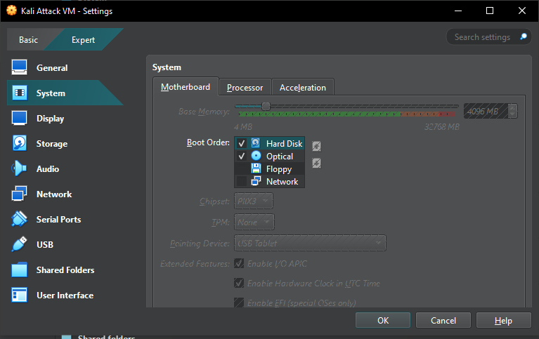
	
	CPU:
	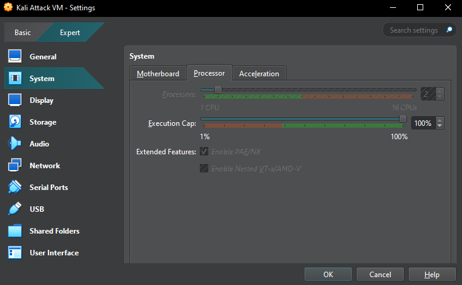
	
	Storage:
	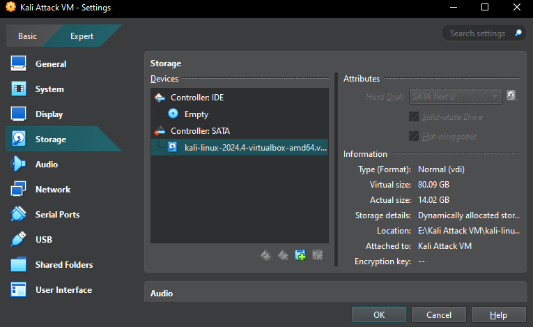

Defense Kali:
	RAM:
 	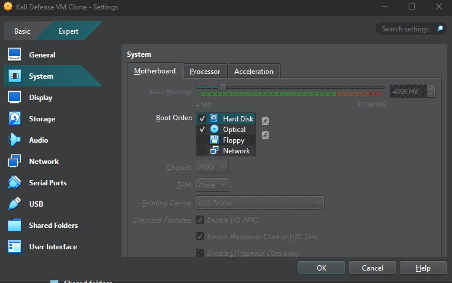
	
	CPU:
 	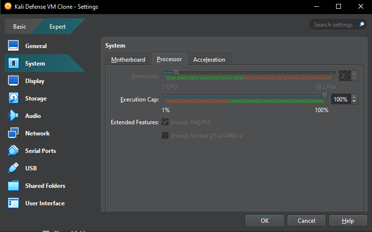
	
	Storage:
 	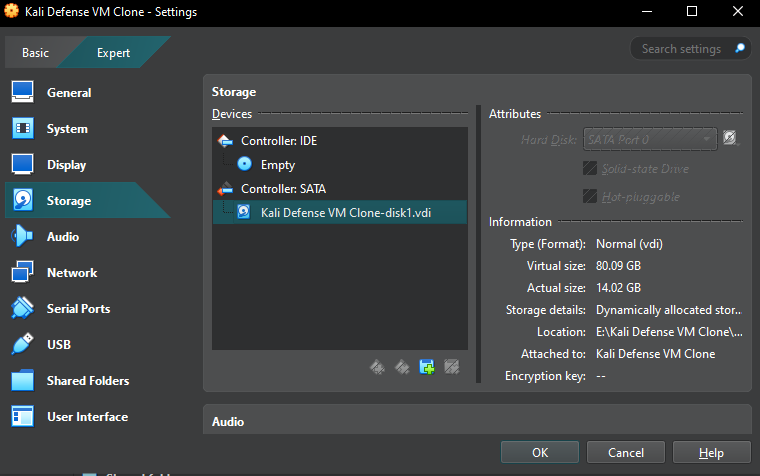
	
MS-2:
	RAM:
	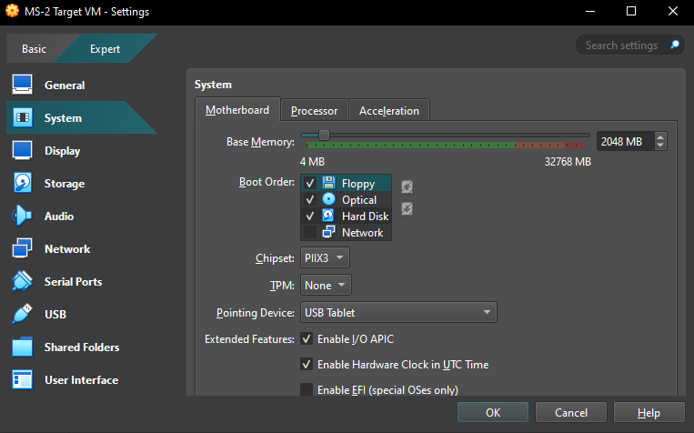
	
	CPU:
	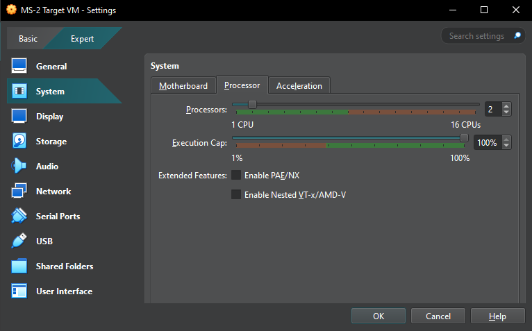
	
	Storage:
	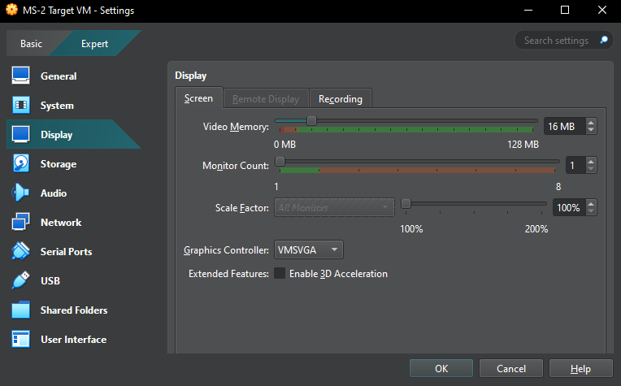

### **2. VM Login Verification**  
- **Screenshots of successful login for all three VMs**  

Attack Kali:
	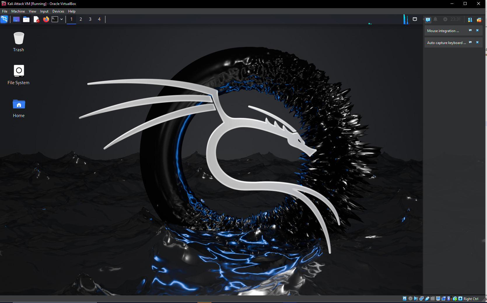

Defense Kali:
 	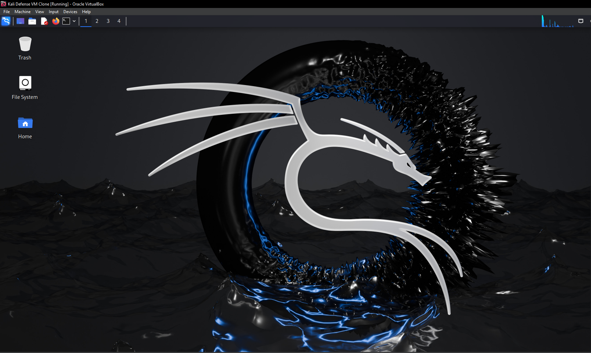
	
MS-2:
	

---

## **Task 2: Linux Basics and Network Connectivity**  

### **1. Check System Information**  
- **Screenshot of commands (`uname -a`, `uptime`, `whoami`, `df -h`)**  

Attack/Defense Kali:
	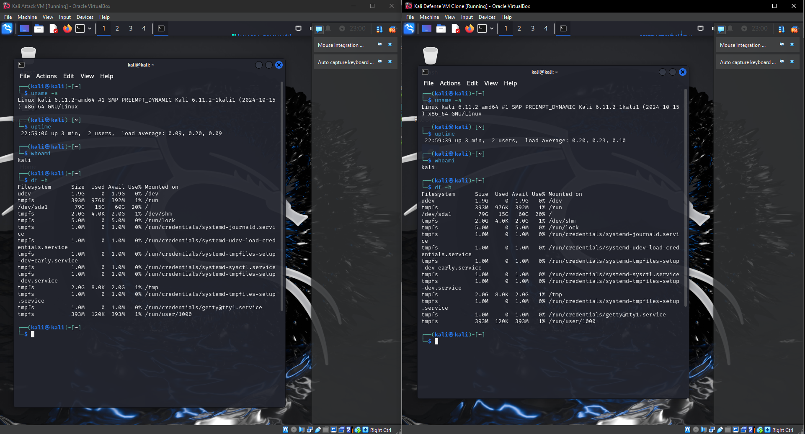
	
MS-2:
	
	
- **Brief Explanation of Outputs**  

uname -a: Provides details about the operating system, kernel version, and system architecture.
uptime: Shows how long the system has been running, along with the load averages indicating system performance.
whoami: Displays the current user logged into the system.
df -h: Shows the amount of disk space used and available on the system’s filesystems.

---

### **2. View Network Configuration**  
- **Screenshot of `ifconfig` or `ip a` and `ip route`**  
Attack/Defense Kali:
	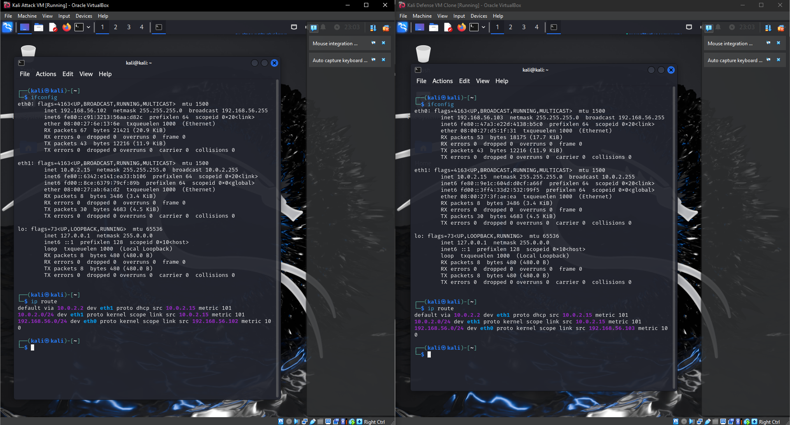
	
MS-2:
	ifconfig:
	
	
	ip route:
	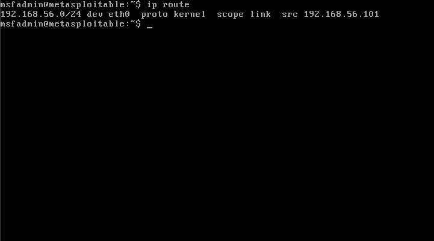
	
- **Explanation of assigned IP and MAC addresses**  
	Kali and MS-2 each have unique IP and MAC addresses used for network communication. IP identifies the device in the network, and MAC identifies it at the hardware level.

- **Does the IP match the expected subnet? Explain why or troubleshoot.**  
	Ensure the IP addresses fall within the expected subnet (e.g., 192.168.x.x). If they don’t, troubleshoot by checking network settings or reassigning IPs. They do in this case.

---

### **3. Test Connectivity Between VMs**  
- **Screenshot of `ping` results between VMs**  
	From Attacker VM (Kali), ping Metasploitable 2:
	
	
	From Metasploitable 2, ping Defense VM (Kali):
	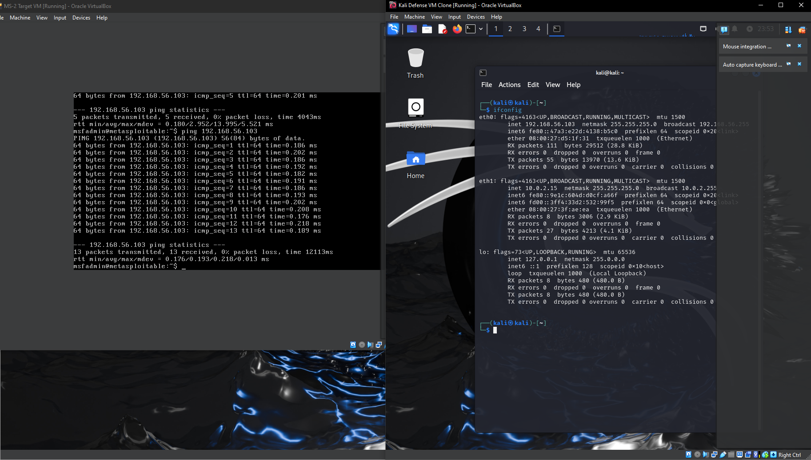
	
- **Explanation of success/failure and troubleshooting steps taken**  
	Need to find the ip address of the VM being pinged using 'ifconfig' the address should be something like: 192.168.x.x

---

### **4. Network Scanning with Nmap**  
- **Screenshot of `nmap -p 1-1024 <Metasploitable2-IP>`**  
	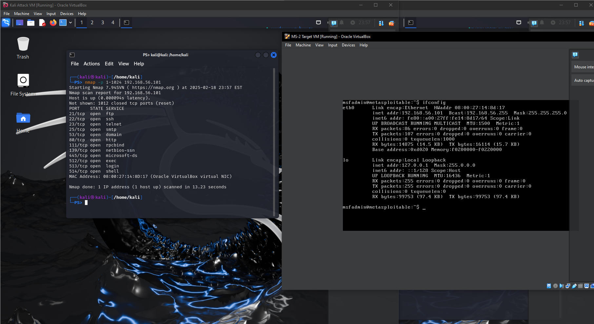
	
- **List five open ports and corresponding services**  
	Port 21/tcp (FTP)
	Port 22/tcp (SSH)
	Port 80/tcp (HTTP)	
	Port 445/tcp (Microsoft-DS)
	Port 23/tcp (Telnet)
	
- **Security risks associated with detected ports**  
	Port 21/tcp (FTP)
	Risk: Unencrypted, making data (including credentials) vulnerable to interception.
	
	Port 22/tcp (SSH)
	Risk: Brute force attacks can exploit weak passwords or misconfigurations like allowing root login.
	
	Port 80/tcp (HTTP)
	Risk: Vulnerable to web-based attacks like SQL injection or XSS if the server or application is not secured.
	
	Port 445/tcp (Microsoft-DS)
	Risk: Exposes the system to SMB vulnerabilities (e.g., EternalBlue), which can lead to remote code execution.
	
	Port 23/tcp (Telnet)
	Risk: Sends data in plaintext, making it easy to intercept passwords and other sensitive information.

---

### **5. Check Running Processes & Active Connections**  
- **Screenshot of `ps aux` and `netstat -tulnp` outputs**  
	ps aux:
	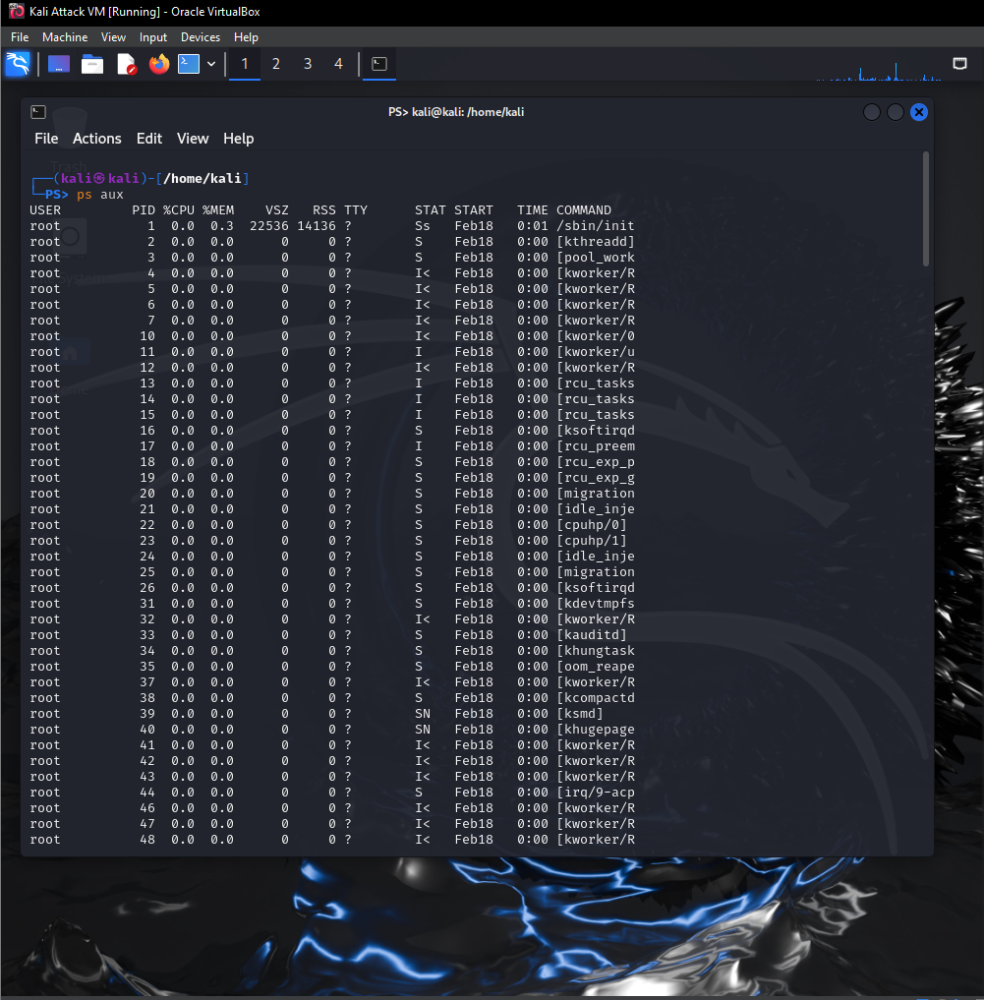
	
	netstat -tulnp:
	
- **Explanation of any suspicious or unusual findings**  

/usr/sbin/cron -f (PID: 600):
	The cron daemon is responsible for executing scheduled tasks. If you have numerous scheduled tasks running on this system, this process should be checked for potential performance issues or failing jobs.

/usr/lib/polkit-1/polkitd (PID: 587):
	This process is related to PolicyKit, a framework for defining and handling authorizations. It usually runs quietly in the background, but it's important to ensure that it isn't being hijacked or used maliciously. A higher-than-usual memory or CPU usage might suggest problems.
